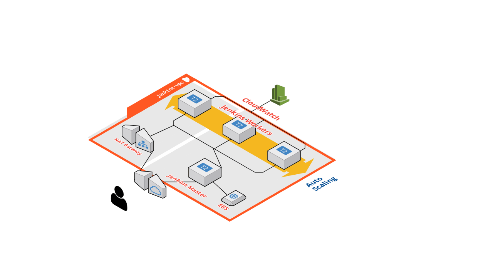

# Jenkins-on-AWS
## Overview


This solution will provide you with a Jenkins Master and three workers which are part of a Auto-Scaling-Group. Workers will automatically register to the Master over SSH and boot time.

Both Master and Workers are created from the same base AMI created with Packer.

Only the Master will be accessible over the Internet on port 80 which Nginx will proxy to Jenkins on port 8080.

Workers will reside in 2 private subnets in eu-west-2 region and will  have access to the Internet via the NAT gateway so it can install packages during the bootstrap phase. 

Master and Workers will have unrestricted access via Security Groups `jenkins-master-worker` and `jenkins-worker-master`. Access can be tied down by modifying the Security Groups.

You will need to have both Packer and Terraform install on your machine, you can find instruction for both here:

```
https://packer.io/intro/getting-started/install.html
https://www.terraform.io/downloads.html
```

## First clone the repository to your machine:

```
$ git clone https://github.com/massaox/Jenkins-on-AWS.git
```

## Creating Base AMI with Packer

First export your AWS credentials to your enviroment variables:

```
$ export AWS_ACCESS_KEY_ID="yourawsaccesskeyhere"
$ export AWS_SECRET_ACCESS_KEY="yourawssecretkeyhere"
```

Now get your AWS account number  which can be found from the AWS console at Support > Support Center > Account number and replace it the following line on `jenkins.json`:

```
    "ami_users": [
      "000000000"
```

From the `packer` directory execute the following command:

```
$ packer build jenkins.json
```

To start with Terrafom you must first create 2 sets of keys for the Master and Workers, Terraform will look for public and private keys named:
```
jenkins-master
jenkins-master.pub
jenkins-worker
jenkins-worker.pub
```

Navigate to the `terraform` directory and run the following command to create the keys, `do not add a passphrase` to the keys as Master must be able to login to Workers passwordlessly:
```
ssh-keygen -t rsa -f jenkins-worker
ssh-keygen -t rsa -f jenkins-master
``` 

Now you can initialize Terraform to download and the providers and plugin:

```
terraform init
```

If you want to only stage the changes run:

```
terraform plan
```

You will be prompted to add your own public IP address to whitelist access to SSH on the Master for troubleshooting and also your desired admin password for the Jenkins UI:

```
terraform apply
```

You can also adjust the following variables to your liking since Master and Workers will most likely have difference resource needs and the env variable can help you differentiate different environments in the same account:

```
variable "instance_type" 
variable "env"
```
